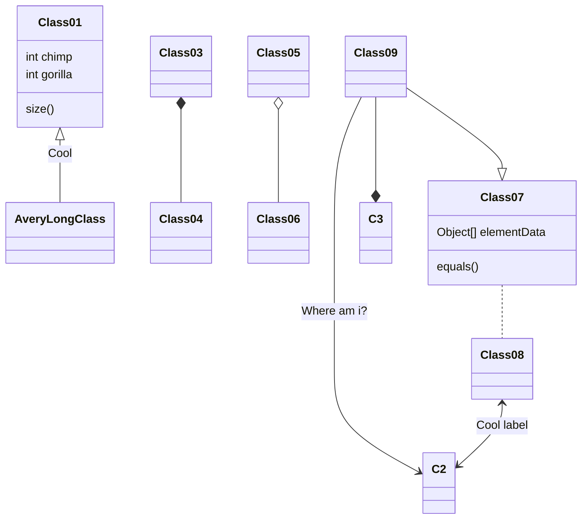

# DiKErnel

## Contents of repository

**Development**\
Files for deploying specific parts of the development environment.

**Dependencies**\
Libraries used in the repository that are not consumed via NuGet.

**Deployment**\
Files for specifying the deployment environment.

**Licenses**\
Full license texts of the libraries used in the repository.

**Src**\
The source code files of DiKErnel.

**Test**\
The test code files of DiKErnel.

**DEPENDENCIES.md**\
Overview of the libraries used in the repository.

**LICENSE**\
The terms under which DiKErnel can be redistributed and/or modified.

## Build

### Requirements for building
- Microsoft Visual Studio 2022 (build tools)
- .NET7 SDK

### Requirements for running
- .NET7 runtime
- Microsoft Visual C++ Redistributable 2022

